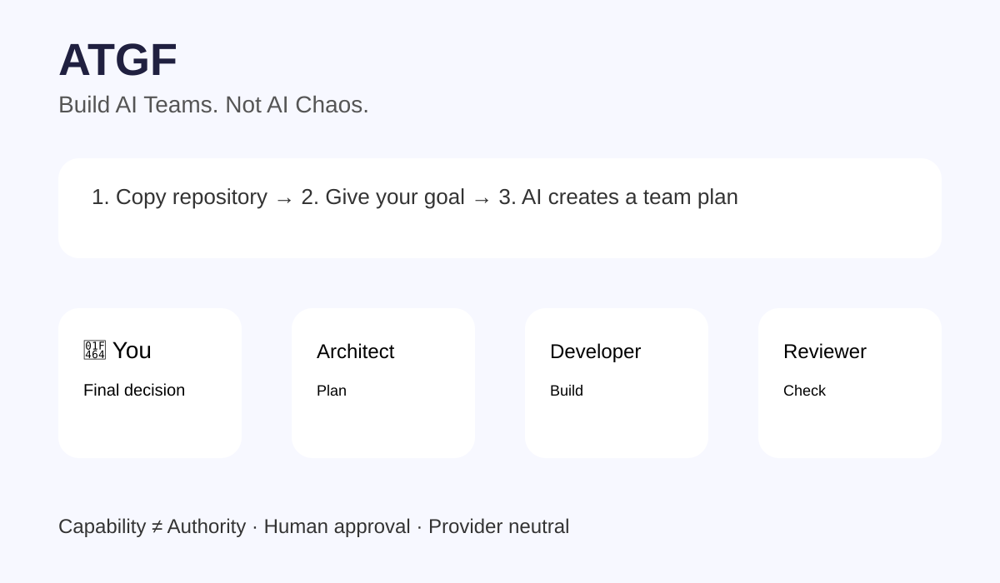

# ATGF — Agent Team Governance Framework



## Đừng giao cả công việc cho một AI duy nhất. Hãy xây một đội có tổ chức.

AI ngày càng mạnh, nhưng một vấn đề mới xuất hiện:

- Ai chịu trách nhiệm khi AI làm sai?
- AI nào nên lập kế hoạch?
- AI nào nên xây dựng?
- Ai kiểm tra lại kết quả?
- Khi nào con người cần quyết định?

**ATGF (Agent Team Governance Framework)** là framework mã nguồn mở giúp bạn tổ chức nhiều AI agent thành một đội làm việc có vai trò, quyền hạn và quy trình rõ ràng.

ATGF không tạo ra một AI mạnh hơn.
ATGF giúp bạn sử dụng AI một cách có tổ chức hơn.

---

# Vấn đề hiện nay

Cách dùng phổ biến:

```
Đưa yêu cầu cho AI
        |
        v
AI tự làm tất cả
```

Phù hợp với việc nhỏ.

Nhưng dự án thật cần:

```
Ý tưởng
 |
v
Lập kế hoạch
 |
v
Xây dựng
 |
v
Kiểm tra
 |
v
Thử nghiệm
 |
v
Con người quyết định
```

---

# ATGF hoạt động như một đội làm việc

Thay vì một AI làm mọi việc, ATGF chia thành các vai trò:

| Vai trò | Công việc |
|---|---|
| 👨‍💼 Người lập kế hoạch (Architect) | Hiểu mục tiêu, thiết kế hướng đi |
| 👨‍💻 Người xây dựng (Developer) | Thực hiện công việc được giao |
| 🔍 Người kiểm tra (Reviewer) | Tìm lỗi và rủi ro |
| 🧪 Người thử nghiệm (Tester) | Kiểm tra kết quả |
| 👤 Con người | Quyết định cuối cùng |

---

# Nguyên tắc cốt lõi

```
Capability != Authority

AI có khả năng không có nghĩa là AI có toàn quyền.

Intelligence != Trust

AI thông minh vẫn cần được kiểm soát.

Autonomy != Unlimited Permission

Tự động hóa không đồng nghĩa với bỏ kiểm soát.
```

---

# Dùng ATGF rất đơn giản

Bạn không cần biết lập trình.

Bước 1:

Copy link repository này vào AI bạn đang dùng:

```
https://github.com/gunchman8/atg-framework
```

Bước 2:

Nói điều bạn muốn làm.

Ví dụ:

```
Tôi muốn làm một app bán hàng.
```

Bước 3:

AI sẽ giúp bạn:

- tạo đội làm việc phù hợp;
- phân chia vai trò;
- đề xuất quyền hạn;
- hỏi bạn trước những thay đổi quan trọng.

---

# Hỗ trợ nhiều nền tảng

ATGF được thiết kế độc lập với nhà cung cấp.

Có thể áp dụng với:

- Codex
- Claude
- Gemini
- LangGraph
- CrewAI
- các hệ thống agent khác

---

# Dành cho ai?

ATGF hữu ích cho:

- người mới muốn sử dụng AI có hệ thống;
- developer xây ứng dụng với nhiều agent;
- đội nhóm muốn tự động hóa công việc;
- doanh nghiệp cần kiểm soát AI automation.

---

# Project Status

Version: **v0.1 Foundation**

Hiện tập trung vào:

- agent roles;
- permission governance;
- workflow templates;
- beginner-friendly onboarding.

Các hướng phát triển tiếp theo:

- runtime governance;
- validation tools;
- provider adapters;
- reference implementations.

---

# Đóng góp

Mọi ý tưởng, góp ý và cải tiến đều được chào đón.

Nếu bạn thấy framework hữu ích, hãy để lại một ⭐ trên GitHub để giúp dự án tiếp cận nhiều người hơn.

---

# License

Apache-2.0
